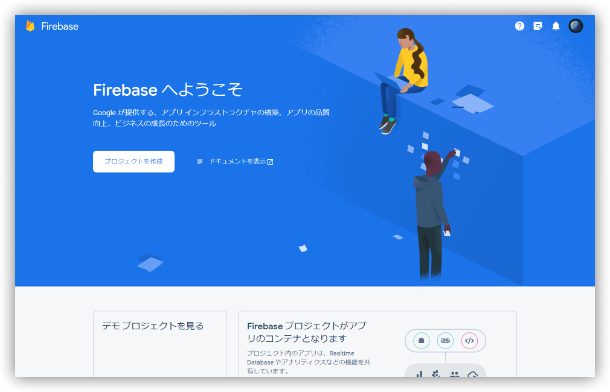
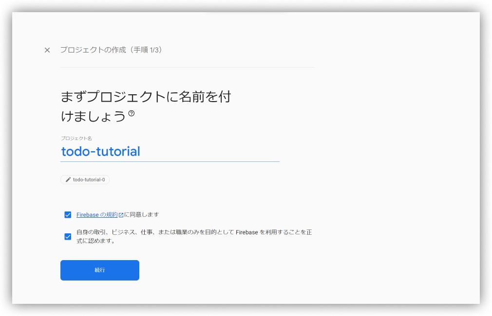
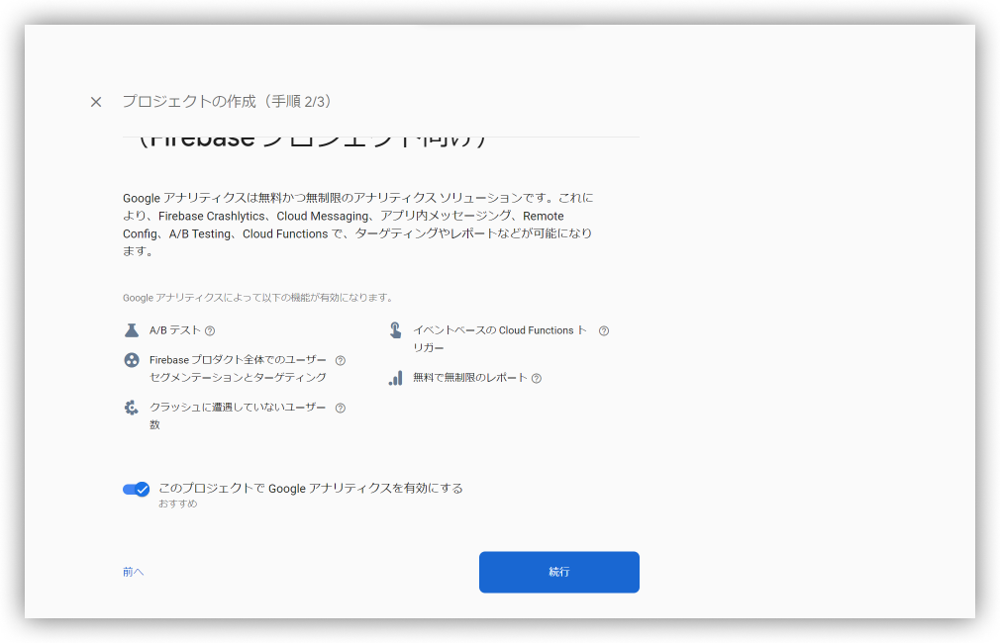
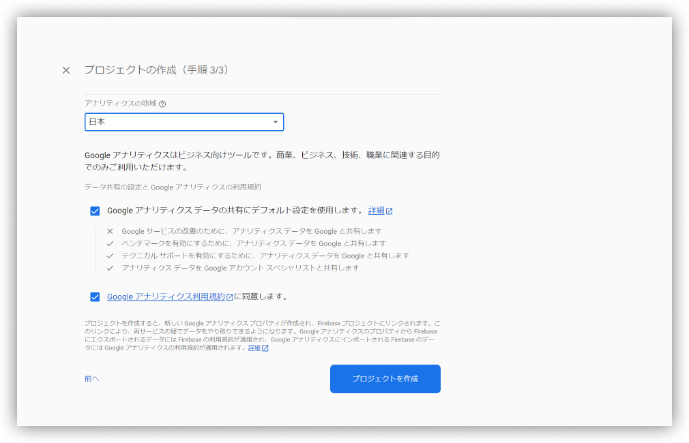
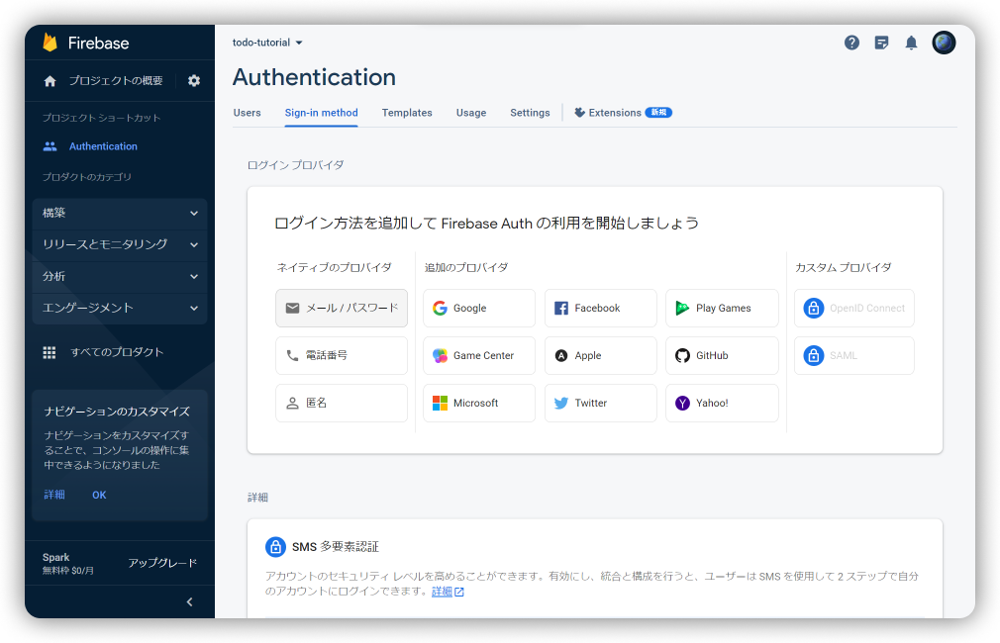
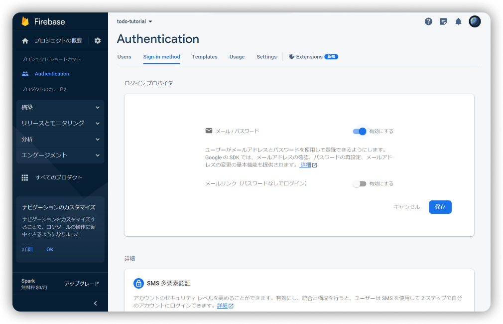
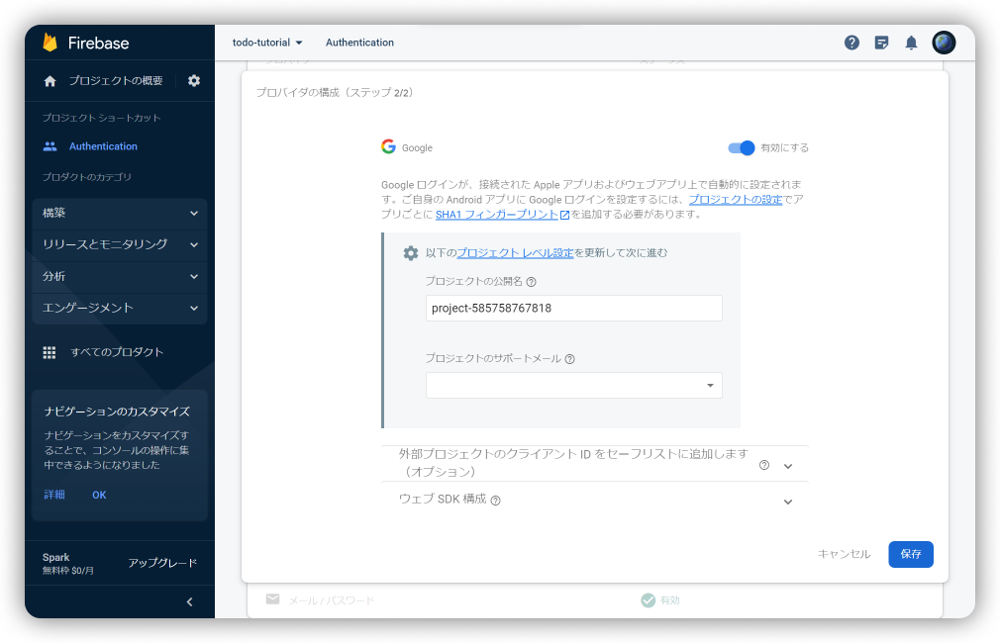

author: 針猫
summary: この Codelab では、FlutterとFirebase及びその関連パッケージの使い方をToDoアプリ制作を通して学びます。
id: todo-app
categories: flutter
environments: Android
status: Draft
feedback link: https://github.com/gdsc-osaka/codelab-flutter-tutorial-todo/issues
analytics account: 198538794

# ToDoアプリ制作を通じて Flutter / Firebase / Riverpod を知る

## はじめに
この Codelab では、次のような Todo アプリの作成を通して Firebase の基本的な使い方を学びます。

### 前提条件
* Flutter の環境構築をします。
  * 環境構築が終わっていない場合は、[初めての Flutter アプリ](https://codelabs.developers.google.com/codelabs/flutter-codelab-first?hl=ja)を参考に Flutter をインストールします。
* お好みのエディタまたは IDE をインストールします。
  * VSCode または Android Studio がおすすめです。

## Firebaseにログイン
Google アカウントで [Firebase](https://console.firebase.google.com) にログインし、新しいプロジェクトを作成します。

### ステップ 0/3
[Firebase](https://console.firebase.google.com) にログインし、プロジェクトの作成をクリック


### ステップ 1/3
プロジェクト名とプロジェクトIDを設定


### ステップ 2/3


### ステップ 3/3
アナリティクスの地域を日本に設定し、✓ を押下


## GitHubからテンプレートプロジェクトをダウンロード
[ここ](https://github.com/gdsc-osaka/todo-app/archive/refs/heads/template.zip) から Todo アプリのテンプレートをダウンロードします。

ダウンロードしたZIPファイルを任意の場所に展開し、エディタまたは IDE でルートディレクトリを開きます。

なお、アプリのソースコードは [GitHub](https://github.com/gdsc-osaka/todo-app) で公開しています。

## Firebaseのインストール
[Flutter アプリに Firebase を追加する](https://firebase.google.com/docs/flutter/setup?hl=ja&platform=ios) を参照してFirebaseをインストールします。

### ステップ 1: 必要なコマンドライン ツールをインストールする


## Riverpodの紹介


## Firebase Authを追加
Firebase Authentication を使えば、メールアドレス/パスワード認証・電話番号認証・Google認証・各SNSの認証をクライアント(アプリ)のプログラムを書くだけで実装できます。
  
<br />
<br />
### ステップ1: アプリに Firebase Authentication を追加する
1. プロジェクトのルートから、ターミナルで以下のコマンドを実行してプラグインをインストールします。
    ```console
    flutter pub add firebase_auth
    ```
2. 以下のコマンドを実行してプラグインを取得します。
    ```console
    flutter pub get
    ```  
  
<br />
<br />
### ステップ2: Firebase Console で Firebase Auth を有効化する
[Firebase Console](https://console.firebase.google.com/) から、以下の手順の通りに認証を有効化します。

1. Authentication を有効化

  
2. メール認証を有効化


  
3. Google認証を有効化


Positive
: メール・Google以外の認証プロバイダの追加については、各ドキュメントを参照してください。

次のセクションでは、アプリ内にユーザー認証を実装します。

## メールログインを追加
このセクションでは、Flutter アプリにメールアドレス認証を追加します。

### **ステップ1**: ログインコードを追加する
`/lib/features/auth/email_login_page.dart` を開き、36行目の `signIn()` にメールアドレス認証を追加します。  
  
```Dart
signIn() async {
  if (_formKey.currentState?.validate() ?? false) {
    // ...

    // Firebase Authを追加
    await FirebaseAuth.instance.signInWithEmailAndPassword(
      email: _email,
      password: _password,
    );
  }
}
```

次に、ログインに失敗したときの例外を追加します。
  
なお、ログインやユーザー登録など、実行する関数によってエラーコード (`e.code`) が異なります。
対応するエラーコードについては、[[Flutter×Firebase] firebase_authのエラーハンドリング(例外処理、try-catch)を学ぶ](https://zenn.dev/hikaru24/articles/7c5d49b0e877b9) などを参照してください。  

```Dart
signIn() async {
  try {
    await FirebaseAuth.instance.signInWithEmailAndPassword(
      email: _email,
      password: _password,
    );

  } on FirebaseAuthException catch (e) {
    if (e.code == 'user-not-found' || e.code == 'wrong-password') {
      // スナックバーを表示
      messenger.showSnackBar(const SnackBar(content: Text('ユーザー名またはパスワードが不明です')));
    }
    
  } catch (e) {
    // デバッグ時のみエラーコードを出力
    if (kDebugMode) {
      print(e);
    }
  }
}
```
### **ステップ2**: LoaderOverlay を表示・非表示する
認証ボタンが押下されたときに Loading のオーバーレイが表示されるコードを追加します。  
なお、以降で省略できる個所は `...` と記述します。  

```Dart
signIn() async {
  if (...) {
    // LoaderOverlayを追加
    context.loaderOverlay.show();
    final messenger = ScaffoldMessenger.of(context);

    try {
      // ...

      if (mounted) {
        context.loaderOverlay.hide();
        context.go(HomePage.name);
      }

    } on FirebaseAuthException catch (e) {
      context.loaderOverlay.hide();

      // ...
      
    } catch (e) {
      // ...
    }
    
  }
}
```
<aside class="positive">
context (BuildContext) を async 関数中で直接使うのはあまりよくありません。したがって、`if (mounted)` を挟んで問題を回避しています。詳しいことは勉強していくうちに分かりますが、知りたい人は個別に聞きに来てください。
</aside>

## メールユーザー登録を追加
このセクションでは、Todo アプリにメールアドレスのユーザー登録を追加します。

### **ステップ1**: ユーザー登録コードを追加
`/lib/features/auth/email_signup_page.dart` を開き、32行目の `signUp()` にユーザー登録のコードを追加します。

```Dart
signUp() async {
  if (...) {
    final credential = await FirebaseAuth.instance.createUserWithEmailAndPassword(
      email: _email,
      password: _password,
    );
  }
}
```
  
前のセクションと同様に、ユーザー登録に失敗したときの例外処理を追加します。  

```Dart
signUp() async {
  if (...) {
    try {
      final credential = await FirebaseAuth.instance.createUserWithEmailAndPassword(
        email: _email,
        password: _password,
      );  

    } on FirebaseAuthException catch (e) {
      if (e.code == 'weak-password') {
        messenger.showSnackBar(const SnackBar(content: Text('より複雑なパスワードを使用してください')));
      } else if (e.code == 'email-already-in-use') {
        messenger.showSnackBar(const SnackBar(content: Text('メールアドレスが既に使用されています')));
      }

    } catch (e) {
      if (kDebugMode) {
        print(e);
      }
      
    }
  }
}
```

### **ステップ2**: LoaderOverlay を表示・非表示する
```Dart
signIn() async {
  if (...) {
    // LoaderOverlayを追加
    context.loaderOverlay.show();
    final messenger = ScaffoldMessenger.of(context);

    try {
      // ...

      if (mounted) {
        context.loaderOverlay.hide();
        context.go(HomePage.name);
      }

    } on FirebaseAuthException catch (e) {
      context.loaderOverlay.hide();

      // ...
      
    } catch (e) {
      // ...
    }
    
  }
}
```

## Google認証の実装
### 前提条件
* (Androidのみ) JDK をインストール済み
  もし JDK をまだインストールしていない場合は、[Java環境構築(Windows版)　JDKインストール](https://www.techfun.co.jp/services/magazine/java/windows-jdk-install.html) を参考に JDK をインストールします。

### **ステップ1**: (Androidのみ) SHA KEYを入手
ターミナルまたはコマンドプロンプトを起動し、Todo アプリのルートディレクトリに移動します。以下のコマンドを実行します。

```Console
cd .\android\
./gradlew signingReport
```
  
[signingReport](./cmd_signingReport.png)
  
`> Task :google_sign_in_android:signingReport` で出力される SHA-1 と SHA-256 をメモしておきます。

[sha](./cmd_googlesha.png)

### **ステップ2**: Google認証を有効化

## Riverpod の追加
Riverpod とは、Flutter 内で簡単に状態(State)を管理できるパッケージです。この Todo アプリでは、Riverpod を使用して Firebase などのデータを管理します。

### Riverpod の追加
以下のコマンドを実行して、アプリに Riverpod を追加します。  

```Console
flutter pub add riverpod
flutter pub get
```

### Riverpod を使ってみる
Firebase Auth から得られるユーザーデータを Riverpod で管理してみましょう。

## Firestore
Cloud Firestore はクライアントコードを書くだけで使用できるサーバーレスなデータベースです。


## データベース設計
## ユーザーデータを追加
このセクションでは、ユーザーのデータを Firestore に保存します。  
`/lib/api/firestore_api.dart` を開き、以下のコードを追加します。  
このコードでは、データベースの users コレクションにユーザーの UID (User ID) を ID としたデータをセットしています。

```Dart
final _db = FirebaseFirestore.instance;
final _users = _db.collection('users');

class FirestoreAPI {
  Future<void> addUser(User user) async {
    final userData = DBUser.map();
    await _users.doc(user.uid).set(userData);
    existsDBUser = true;
  }
}
```

次に、Firebase Auth の実装で使用した `/lib/features/auth/email_signup_page.dart` を開き、以下のコードを追加します。

```Dart
signUp() async {
  if (...) {
    // ...

    try {
      final credential = await FirebaseAuth.instance.createUserWithEmailAndPassword(
        email: _email,
        password: _password,
      );

      final user = credential.user;

      if (user != null) {
        FirestoreAPI.instance.addUser(user);
      }

      // ...
    } on FirebaseAuthException catch (e) {
      // ...
    }
  }
}
```

これにより、新しくユーザー登録されたときに Firestore にもデータが追加されるようになりました。  
次のセクションでは、Todo のタスクを追加する方法を学びます。

## タスクデータを追加


## Storage